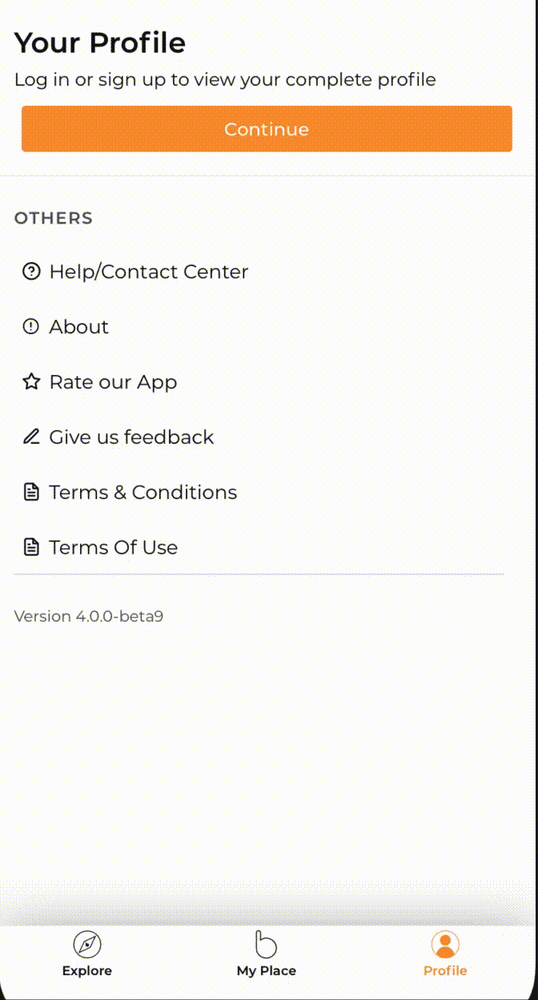

# React Native Toast

React Native JS level toast for both android and IOS which can be called from any component of your app.

## Install

```
npm install @asaeed14/react-native-toast
```

OR

```
yarn add @asaeed14/react-native-toast
```

## Example



## How to Use

Wrap your application parent with `ToastProvider`.

```ts
import { ToastProvider } from 'react-native-js-toast';

const App = () => {
  return (
    <ToastProvider>
      <App />
    </ToastProvider>
  );
};
```

You can use `toast.show({})` from any of your component or screen.

```js
// this is jsut an example you can call from anywhere based on your requirement.
import { useToastContext } from 'react-native-js-toast';

const LoginScreen = () => {
  const toast = useToastContext();
  useEffect(() => {
    if (login.success) {
      toast.show({
        message: 'Login Successfully',
        delay: 3000,
        position: 'bottom',
        bottomSpace: 32,
      });
    }
  }, [login]);

  return <View />;
};
```

## Props

| Name        | Type              | Required |           default            |               Description               |
| ----------- | ----------------- | :------: | :--------------------------: | :-------------------------------------: |
| message     | string            |  false   | welome to react native toast |           A message for toast           |
| delay       | number            |  false   |             1000             |   number of milisecond to show toast    |
| position    | 'bottom' or 'top' |  false   |            bottom            |         position to show toast          |
| bottomSpace | number            |  false   |              32              | space from bottom if position is bottom |
| topSpace    | number            |  false   |              32              |  space from bottom if position is top   |
